+++
date = '2026-08-17T10:06:32+01:00'
draft = false
math = true
title = 'Improving Throughput by Optimising KV Cache Memory Usage for Agentic Workloads'
summary = 'Boosting throughput by leveraging characteristics of agentic workloads to optimise KV cache memory usage.'
+++

Throughput is defined by how quickly we can serve requests in aggregate. From the perspective of the inference engine, agentic and chat requests are largely indistinguishable, but have importantly different characteristics. We can leverage these characteristics to make informed decisions about how we can better manage each request's KV cache to alleviate memory pressure, allowing us to admit more concurrent requests.

Let's start by establishing what an agent actually is, and where their requests differ from those of a typical chat conversation.

# Agentic Inference
An agent is simply a model wrapped in a harness. The model is prompted to emit a fenced block when it wants to perform an action:
```xml
# Hermes style (see https://github.com/NousResearch/Hermes-Function-Calling#inference-example-output)
<tool_call>
{
  "tool": "edit_file",
  "arguments": {
    "path": "src/parser.py",
    "diff": "..."
  }
}
</tool_call>
```
[vLLM](https://docs.vllm.ai/en/latest/features/tool_calling/#automatic-function-calling) and [sglang](https://docs.sglang.io/docs/advanced_features/tool_parser) both ship tool call parsers that turn the model's raw fenced output into a [structure embedded in the response object](https://github.com/vllm-project/vllm/blob/52c70b210ce9d66e9afb9d18e086c3d05408c492/vllm/entrypoints/openai/chat_completion/protocol.py#L68) that is returned via the API. It is then the responsibility of the harness to act upon these tool calls, returning the tool's output, alongside prior context, back to the model upon completion; thus, agency lives within the harness. From the perspective of the model, agentic workloads appear as regular chat requests. They do, however, have markedly different properties. Let's take a look.

<small>*Note: chat data was sourced from [ShareChat](https://arxiv.org/abs/2512.17843), using Grok and OpenAI only (most complete timestamps). Skews towards chats worth sharing, not typical usage. Agent data is sourced from a custom harness running SWE-bench Lite against Qwen3-32B-FP8. Skews towards shorter, well-scoped issues from popular repos.*</small>

### **Longer context and faster growth**

Firstly: agentic trajectories start with a higher token usage, caused by bulkier system prompts (including various tool definitions, etc.), and grow faster (tool outputs are dumped into context, and more reasoning occurs). By turn 10, the median agent trajectory is running close to double the context of a chat conversation. This context also grows for much longer -- in our example, we have only one agent trajectory that exceeded 20 turns. This, however, is supported by one paper which examines agent trajectories with a mean turn count of 37, and a range of 1-2,518 ([Yuan et. al](https://arxiv.org/abs/2604.16682)), while another finds 54% of chat conversations are single turn requests, with 50th and 90th percentile turn-counts of 1 and 5 ([Wang et. al](https://arxiv.org/abs/2506.02634)).

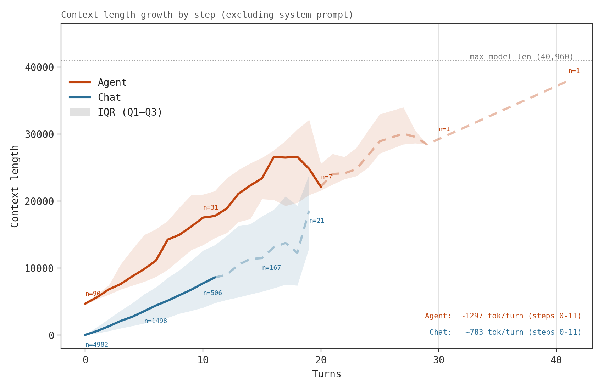

<small>*Note: the dip in context length around turn 16 is a reflection of the properties of surviving trajectories in this sample.*</small>

We can visualise agent trajectories split by prefill and decode:

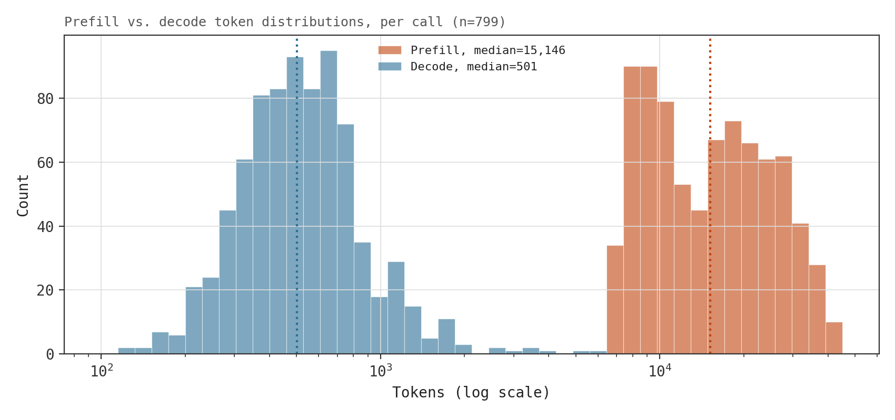
<br>
Per turn, we have to process a median of 15,146 tokens of prefill, and generate a median of 501 tokens of decode. Rather than re-computing prefill from scratch each turn, we're able to cache the result and reuse it -- this is the KV cache:
<br>
<br>
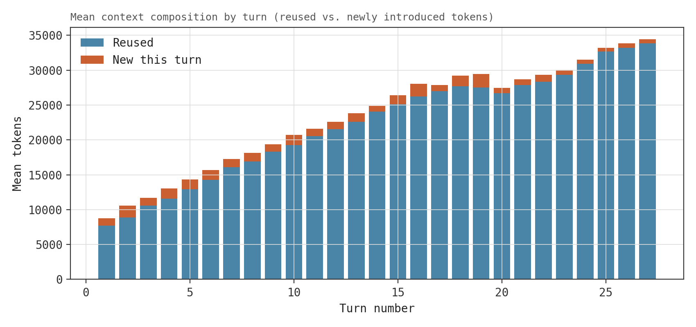

For each token, we store one key vector and one value vector per layer, per KV head. For a model using multi-head attention ('vanilla'), this costs:
$$
\text{bytes per token} = 2 \times \text{num\_layers} \times \text{num\_kv\_heads} \times \text{head\_dim} \times \text{bytes\_per\_element}
$$

For Qwen3-32B-FP8 (our model of choice for this post), which has 64 layers, 8 KV heads, and a `head_dim` of 128, at BF16 this costs:
$$
2 \times 64 \times 8 \times 128 \times 2 = 256 \text{ KiB/token}
$$

We exchange a median 15,146-token recompute for ~3.9GB KV cache that has to live somewhere in GPU memory for as long as the sequence is in flight, growing by 256KiB for each new token. Versus chat conversations, we face substantially higher memory pressure per active trajectory, meaning we're able to serve fewer concurrent requests. 

This GPU memory is finite -- once the request stops running, its KV cache becomes eligible for eviction: if a new request arrives and finds there is no room left to admit it, resident KV cache is evicted (removed from VRAM) to make room for it. For each individual request, we have three options:
- We can keep it resident in VRAM (pinning) -- fine if we have sufficient memory to admit other requests, not so good if other requests need the space;
- we can allow it to be evicted and destroyed, and we'll recompute the next time we encounter the request (not so good);
- or we can make copies of its KV cache further up the memory hierarchy (CPU RAM first, then disk, etc.) and reload to VRAM when needed.

Destroying and recompute is a non-starter: we'd contend against other requests in our inference engine for compute time, slowing the queue, and, worse, recomputing is substantially slower than reloading. Pinning and offload/reload both come with cost, and to decide which is cheaper, we need to examine how much time passes between requests.

### **Gap Durations and Closed-Endedness**
Human chat requests' gap duration skew substantially longer than agentic requests: once you've read a response, you need time to digest, formulate a response, then send. A harness simply executes assigned tool calls then returns their output, clustering gaps substantially shorter with a median return time of 0.18s versus chat requests' 96.24s. 

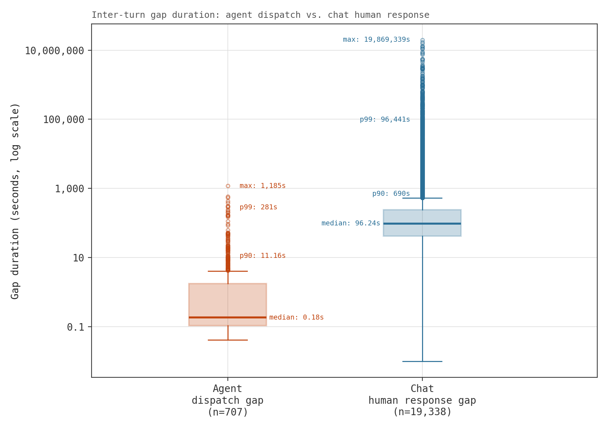

Broadly, it almost always makes sense to allow a chat request's KV cache to be evicted from VRAM (ideally we do not hold a KV cache resident for 19 million seconds -- that would probably be a bad idea): it is almost always cheaper to evicted and reload at resumption. For agentic loads, which send follow-up requests substantially faster, that decision is more nuanced.

Computed KV blocks are [backed up to CPU RAM (offloaded) as they're computed](https://docs.vllm.ai/en/latest/features/kv_offloading_usage/#:~:text=offloading%20completed,as%20they%20are%20produced), and so we need only pay the reload cost (the offload cost is paid by default). The reload (and offload) occurs on a dedicated copy engine, [asynchronously with compute](https://docs.vllm.ai/en/latest/features/kv_offloading_usage/#:~:text=transfers%20between,overhead); thus, we do not delay compute. However, destination slots have to be [allocated *before* the load](https://github.com/vllm-project/vllm/blob/ca9c8cbd1bfb6a3fdcd3abf64b7204d967f539f0/vllm/distributed/kv_transfer/kv_connector/v1/base.py#L510) -- meaning fewer free memory slots (and so fewer resident requests) while the load completes. So we consider two costs: we either pin the KV cache in memory, in which case memory is occupied for the *entire gap* (up to 1,185s in the worst case we observed); or, we can offload from VRAM and reload on demand, in which case we sacrifice memory capacity only for the duration of the load, and accept some wasteful offloads. The better decision is the one which pre-occupies the least memory time.

Assuming our single agent request has full reign of the PCIe channel (PCIe 5.0 x16 is ~64GB/s uni-directionally), reloading takes around 4.16μs per token at BF16. At the median gap duration (0.18s), a context length of around 43,270 tokens marks the threshold: below this threshold, the median gap takes longer than a reload, and so reloading is the cheaper option (costing less reserved memory time); above it, reloading would take longer than the request did to return (costing more reserved memory time). The threshold moves with the expected gap duration, the context length, and the achievable transfer speed. This, of course, is confounded by the time a returning request spends in the admission queue waiting to be scheduled by the inference engine -- but we'll ignore this for now (and it will come back to bite us later -- I found out rather too late that it adds seconds to any gap duration when under pressure).

The maximum context length of Qwen3-32B is 40,960 tokens, so we never quite reach this threshold -- however [Li et. al](https://arxiv.org/abs/2511.02230) report a mean context length of 70,126 on SWE-Bench tasks while a [write-up from llm-d](https://llm-d.ai/blog/serving-glm-5-2-agentic-workloads-on-llm-d) analyses traces from Claude Code production sessions to find median main-agent context length of around 195K tokens. We can plot these points, using our measured median gap duration$^1$, against our threshold for a range of achieved bandwidths to get an idea of when pinning pays off:

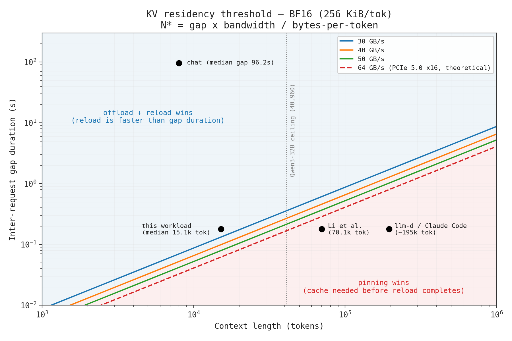

Ultimately, we can't pin the cache forever, lest we starve other requests of memory -- the cache will need to be evicted at some point. Perhaps instead we can think of a way to reorder the eviction queue, such that we deprioritise the eviction of cache we think will be needed soon in favour of cache we think won't be needed for a while?

We also note that agentic trajectories are inherently **closed-ended**: whereas chat conversations are arbitrarily re-opened and extended at will (even months after starting), agent trajectories have a definitive termination state. Which brings us to our next section ...

<small>$^1$We don't expect the real traces to share the same gap duration -- it's purely illustrative.</small>

### **Statefulness**
Chat conversations are inherently stateless -- there is no underlying process to describe. A human reading and replying to a response is not executing anything that a system is able to observe. By contrast, the agent harness is a running program which holds a substantial amount of information about its state: a process ID, a process graph (if we're using sub-agents or some non-linear topology), a well-defined current state (which tool call is in-flight, which sub-agent it's waiting on, etc.), and a definitive termination state. The inference engine, then, is this [program's scheduler and executor](https://pages.cs.wisc.edu/~remzi/OSTEP/).

Current engines account only for the former case, exposing endpoints which assume stateless requests. The harness's state is discarded at the API boundary, invisible to the layer making retention, eviction, and scheduling decisions. This state is valuable information, and we could use it to, for example:  
- Improve KV cache management:
    - Reclaim a trajectory's blocks immediately on a termination signal ([Continuum](https://arxiv.org/abs/2511.02230); [Autellix](https://arxiv.org/abs/2502.13965))
    - Use the current tool state to determine if we retain or offload ([TokenCake](https://arxiv.org/abs/2510.18586); [Continuum](https://arxiv.org/abs/2511.02230); [CacheWise](https://arxiv.org/abs/2606.16824))
    - Leverage the process graph to determine eviction based on distance to next execution, and prefetch the next agent's prefix before it's needed ([KVFlow](https://arxiv.org/abs/2507.07400))
- Change how we schedule/order requests:
    - Attribute scheduling at the program, rather than the request level ([Continuum](https://arxiv.org/abs/2511.02230); [Autellix](https://arxiv.org/abs/2502.13965); [HexAGenT](https://arxiv.org/abs/2605.16637))
    - Distinguish resumptions from cold arrivals so that we can better decide which requests to defer under pressure ([Autellix](https://arxiv.org/abs/2502.13965))
    - Prioritise requests that share an already-resident prefix (e.g., sub-agent siblings) ([PEEK](https://arxiv.org/abs/2607.02525))
    - Prioritise requests on the workflow's critical path such that non-critical tasks don't starve it ([TokenCake](https://arxiv.org/abs/2510.18586); [HexAGenT](https://arxiv.org/abs/2605.16637))
- Make better informed routing decisions ([SMetric](https://arxiv.org/abs/2607.08565))

The remainder of the post will attempt to optimise memory usage of agentic workloads given their discussed characteristics.

## Experimental Approach
Firstly, the inference engine: I chose vLLM simply because it's the one I'm most familiar with -- handy when it comes to producing custom forks.

The harness (kindly built by Claude) orchestrates requests between [OpenHands](https://github.com/OpenHands/openhands) (an open-source agent SDK; executes tool calls within sandboxed repos, then feeds back results) and the inference engine. Tasks are drawn from [SWE-bench Lite](https://www.swebench.com/lite.html), and are allocated deterministically in round-robin fashion amongst worker processes.

Requests are intercepted by a logging proxy that sits between OpenHands and vLLM, performing book-keeping (such as assigning turn numbers, session/sequence IDs, etc.), logging (we scrape a wide set of metrics from [vLLM's `/metrics` endpoint](https://docs.vllm.ai/en/stable/design/metrics/)) and, later on, augmenting requests with state.

Each experiment proceeds by launching `n` concurrent worker processes; each worker process is assigned one task, draining from a pool of `2 * n` tasks. Due to [expense](https://www.shutterstock.com/shutterstock/photos/577019155/display_1500/stock-photo-man-hand-open-an-empty-wallet-on-white-background-577019155.jpg) (GPU rental is not cheap when accounting for time spent on implementing, debugging, failed runs, re-runs, etc.), each run is capped at 30 minutes. This was deemed a sensible number given the empirical mean baseline trajectory time was 7 minutes. For each experiment, `n` was swept across a range of values to judge how the inference engine performed at different levels of concurrent load (and so memory/scheduling pressure) under the given approach.

Two things were initially scoped and dropped: the harness has functionality for [Poisson arrivals](https://www.probabilitycourse.com/chapter11/11_1_2_basic_concepts_of_the_poisson_process.php) to simulate real-world, open-loop behaviour -- however tuning arrival rate to achieve a steady state, while accounting for ramp-up, proved expensive and fiddly enough that using simple concurrent requests won out; and also sub-agent delegation -- while the agent was allowed to deploy sub-agents, the low complexity of the SWE-bench Lite tasks meant that it never did. 

To my endless annoyance, trajectories were not reproducible run-to-run due to [batch-dependent floating-point non-associativity](https://thinkingmachines.ai/blog/defeating-nondeterminism-in-llm-inference/). This meant countless hours (and £££) spent trying to determine if a datapoint represented signal or noise. Combined with the cost of running sweeps, ultimately repeated runs per condition were not financially viable. Thus, what follows is not a controlled or statistically powered study (sorry); the intent, rather, is to establish and discuss the shape of the effect rather than to bound it within a confidence interval.

Let's get started. Given the centrality of vLLM's scheduler to the remainder of our work, I'll begin with an explanation of how it works under the hood.

## vLLM's Scheduler
*Feel free to skip this section: the main takeaway is that KV cache is allocated in 16-token blocks (the total number of which is defined at startup) which are drained from a least-recently used eviction queue.* 

When a request lands at the [chat completions endpoint](https://github.com/vllm-project/vllm/blob/7aa248fcfef5ba7a6bfb0ce314e328ce63abb9f9/vllm/entrypoints/openai/chat_completion/api_router.py#L53), the request is firstly [pre-processed](https://github.com/vllm-project/vllm/blob/7aa248fcfef5ba7a6bfb0ce314e328ce63abb9f9/vllm/renderers/online_renderer.py#L117) and [tokenised](https://github.com/vllm-project/vllm/blob/7aa248fcfef5ba7a6bfb0ce314e328ce63abb9f9/vllm/renderers/base.py#L516), before being [packaged](https://github.com/vllm-project/vllm/blob/7aa248fcfef5ba7a6bfb0ce314e328ce63abb9f9/vllm/renderers/base.py#L835) into engine-friendly [input objects](https://github.com/vllm-project/vllm/blob/7aa248fcfef5ba7a6bfb0ce314e328ce63abb9f9/vllm/inputs/engine.py#L31). These are then [packaged up](https://github.com/vllm-project/vllm/blob/b1b752042f622c692d5019c3ea122f2f7ee9d6ac/vllm/v1/engine/input_processor.py#L244), alongside other objects (e.g., sampling parameters, LoRA, priority, etc.), into an [EngineCoreRequest object](https://github.com/vllm-project/vllm/blob/main/vllm/v1/engine/__init__.py#L97). This EngineCoreRequest object is then [passed across](https://github.com/vllm-project/vllm/blob/b1b752042f622c692d5019c3ea122f2f7ee9d6ac/vllm/v1/engine/core_client.py#L1148) to the EngineCore process via ZMQ$^2$, and [placed](https://github.com/vllm-project/vllm/blob/b1b752042f622c692d5019c3ea122f2f7ee9d6ac/vllm/v1/engine/core.py#L436) in the [scheduler's internal wait queue](https://github.com/vllm-project/vllm/blob/b1b752042f622c692d5019c3ea122f2f7ee9d6ac/vllm/v1/core/sched/scheduler.py#L2257). 

From the perspective of the scheduler, there is [no prefill phase and no decode phase](https://github.com/vllm-project/vllm/blob/63a9a5010a6d1539c52957646ef9d6bbcf7a4deb/vllm/v1/core/sched/scheduler.py#L478). Each request is a cursor chasing a target -- the number of computed tokens trailing a count of total tokens (for decode the cursor is always one step behind; for prefill, it is the length of the prompt) -- and the role of the scheduler is to hand out token allocations to close the gap.

The scheduler is [stepped by the EngineCore](https://github.com/vllm-project/vllm/blob/63a9a5010a6d1539c52957646ef9d6bbcf7a4deb/vllm/v1/engine/core.py#L592) to generate a plan which is then fed into the model executor to run the forward pass. It oversees two queues$^3$: the `running` queue, which holds all in-flight requests -- those that are mid-decode and mid-prefill; and the `waiting` queue, by default ordered by [first-come first-served](https://github.com/vllm-project/vllm/blob/63a9a5010a6d1539c52957646ef9d6bbcf7a4deb/vllm/v1/core/sched/request_queue.py#L75) (FCFS) (though [priority](https://github.com/vllm-project/vllm/blob/63a9a5010a6d1539c52957646ef9d6bbcf7a4deb/vllm/v1/core/sched/request_queue.py#L131) ordering is also an option), that holds admitted but not yet started requests. 

On each step, the scheduler is assigned three budgets that it must work within:
1. [**Token budget**](https://github.com/vllm-project/vllm/blob/b1b752042f622c692d5019c3ea122f2f7ee9d6ac/vllm/v1/engine/core.py#L496): Defined via config (`max_num_batched_tokens`), it states how many token positions one forward pass can contain, existing to bound a single step's latency.
2. **Maximum number of running requests**: Caps the batch by request count rather than token count -- per-request costs (e.g., sampling params, block tables, etc.) scale with the request count
3. **Supply of free KV cache blocks**: Blocks are committed across steps and released only when a request finishes or is preempted.

The idea behind allocating memory for KV cache in blocks comes from [PagedAttention](https://arxiv.org/abs/2309.06180), which I'll largely skip over here because it's worthy of its [own post](https://hamzaelshafie.bearblog.dev/paged-attention-from-first-principles-a-view-inside-vllm/). The count is determined at startup during a profiling pass which [establishes](https://github.com/vllm-project/vllm/blob/c6741b2ad48a46e87d2cce35d113c4ae0950af91/vllm/v1/worker/gpu_worker.py#L407) how much free memory remains after weights and peak activations. The free capacity is divided by the per-layer page size and the layer count (where the page size is just $\text{block size} \times \text{bytes per token}$; block size is 16 by default, and we derived bytes per token earlier) to yield the [total number of available blocks](https://github.com/vllm-project/vllm/blob/63a9a5010a6d1539c52957646ef9d6bbcf7a4deb/vllm/v1/core/kv_cache_utils.py#L973). Blocks are simply slices of KV storage, addressable by an integer ID, with a [Python-side descriptor](https://github.com/vllm-project/vllm/blob/63a9a5010a6d1539c52957646ef9d6bbcf7a4deb/vllm/v1/core/kv_cache_utils.py#L119) (living in a [block pool](https://github.com/vllm-project/vllm/blob/63a9a5010a6d1539c52957646ef9d6bbcf7a4deb/vllm/v1/core/block_pool.py#L143)) tracking its reference count, content hash, and position in the eviction queue. 

While a request holds a block (i.e., the request is currently in-flight), it is spared from the eviction queue by a [non-zero reference count](https://github.com/vllm-project/vllm/blob/63a9a5010a6d1539c52957646ef9d6bbcf7a4deb/vllm/v1/core/block_pool.py#L702). For blocks not attached to any live requests, their refcount is zero, and they are made eligible for eviction by being placed in the LRU eviction queue. Requests that share a prefix also share the blocks that compose this prefix, and so refcount can be greater than 1. Hashing is what makes sharing prefix blocks possible: when a block is filled (16 tokens), a [hash is computed](https://github.com/vllm-project/vllm/blob/63a9a5010a6d1539c52957646ef9d6bbcf7a4deb/vllm/v1/core/kv_cache_utils.py#L577) over its token IDs, chained onto the hash of the block before it such that a block's identity encodes the entire prefix leading up to it. Once computed, they are published into the block pool's [hash index](https://github.com/vllm-project/vllm/blob/63a9a5010a6d1539c52957646ef9d6bbcf7a4deb/vllm/v1/core/block_pool.py#L33). Incoming requests can then be prefix matched by walking down their block hashes and stopping at the first miss. For this reason, blocks are returned to the queue in reverse sequence order (so the tail of a sequence is given up before its prefix), and maintain their hash and content up to the point they are evicted. [Allocating blocks](https://github.com/vllm-project/vllm/blob/main/vllm/v1/core/kv_cache_manager.py#L347) is handled by the KVCacheManager, which computes how many blocks the requested token count needs (including look-ahead slots reserved for speculative drafts), and either pops the blocks from the block pool, increases the refcount of existing blocks, or signals that there are no blocks available.

The `running` queue is [scheduled first](https://github.com/vllm-project/vllm/blob/b1b752042f622c692d5019c3ea122f2f7ee9d6ac/vllm/v1/engine/core.py#L523): memory is already resident, and progressing an in-flight generation moves it closer to releasing its blocks. The queue is walked in order (by arrival), giving decode priority (prefill -- where we're processing the prompt -- implies a newly-admitted request; decode implies mid-response). The [number of tokens](https://github.com/vllm-project/vllm/blob/63a9a5010a6d1539c52957646ef9d6bbcf7a4deb/vllm/v1/core/sched/scheduler.py#L558) needed to progress this request is defined -- one token for decode (subject to speculative decoding, which drafts ahead of generation such that the model can verify multiple tokens in parallel), and the remainder for prefill. The prefill budget is then clamped by whatever remains of the total budget after decode requests have been scheduled, and so a prompt which exceeds it is simply chunked across subsequent passes (chunked prefill!).

The request will fill empty space in blocks it already holds, and then if necessary, [request more](https://github.com/vllm-project/vllm/blob/63a9a5010a6d1539c52957646ef9d6bbcf7a4deb/vllm/v1/core/sched/scheduler.py#L628) from the KVCacheManager. If there are no blocks available to successfully schedule a running request for this pass, the scheduler will [pre-empt](https://github.com/vllm-project/vllm/blob/63a9a5010a6d1539c52957646ef9d6bbcf7a4deb/vllm/v1/core/sched/scheduler.py#L641): this means that another request is evicted and its blocks placed in the eviction queue before the request is returned to the waiting queue -- by default, under the default FCFS policy, the victim is the most recently admitted (LIFO); under priority-based scheduling, the least-important victim is evicted. 

Once the running queue has been scheduled, assuming there were no preemptions, the scheduler goes on to [admit the `waiting` queue](https://github.com/vllm-project/vllm/blob/63a9a5010a6d1539c52957646ef9d6bbcf7a4deb/vllm/v1/core/sched/scheduler.py#L747). The scheduler peeks at the requests in the queue, checks how many tokens it's requesting, performs the prefix [cache lookup](https://github.com/vllm-project/vllm/blob/63a9a5010a6d1539c52957646ef9d6bbcf7a4deb/vllm/v1/core/sched/scheduler.py#L810), and uses whatever it finds to adjust how many tokens it requests. Then, scheduling proceeds in much the same way: the scheduler will try to allocate blocks to the requests, and failing that, break the loop.

On completion, the output is assembled into a [SchedulerOutput](https://github.com/vllm-project/vllm/blob/63a9a5010a6d1539c52957646ef9d6bbcf7a4deb/vllm/v1/core/sched/scheduler.py#L193) object and returned to the EngineCore to be [passed](https://github.com/vllm-project/vllm/blob/63a9a5010a6d1539c52957646ef9d6bbcf7a4deb/vllm/v1/engine/core.py#L593) to the [model executor](https://github.com/vllm-project/vllm/blob/63a9a5010a6d1539c52957646ef9d6bbcf7a4deb/vllm/v1/worker/gpu_worker.py#L1026).

This leaves us with a few potential optimisations -- we'll tackle:
1. Increasing the number of blocks by decreasing their individual memory footprint;
2. Facilitating offloading of blocks up the memory hierarchy, such that we do not need to recompute after eviction;
3. Reordering the eviction queue using hints derived from state.

<small>$^2$A single-GPU vLLM instance is comprised of two primary processes: the API server (which accepts incoming requests, and returns responses), and the engine. ZMQ enables us to perform inter-process communication.</small>

<small>$^3$Okay, three queues: it also oversees a `skipped_waiting` queue, which exists to hold requests that are temporarily inadmittable -- for example, due to awaiting a remote KV transfer (see our earlier discussion on reloading). But it's not important right now.</small>

## Managing the KV Cache
To get a sense of how our optimisations perform, let's first profile the base case:
```bash
vllm serve --host 0.0.0.0 --port 8000 --model Qwen/Qwen3-32B-FP8 --gpu-memory-utilization 0.90 \
    --max-model-len 40960 --enable-auto-tool-choice --tool-call-parser hermes --enable-prefix-caching
```

The KV cache, by default, is stored in BF16, and so each token (as derived earlier) takes 256KiB of memory. We can see that there exists a distinct elbow between `c=12` and `c=20`: this represents the transition from an underloaded engine to an overloaded one; prefix reuse drops precipitously as request's blocks are evicted during their gaps (tool calls) in order to admit new requests. Offloading is not enabled by default, and so those dropped blocks must be recomputed when the request returns (rebuild tax). 

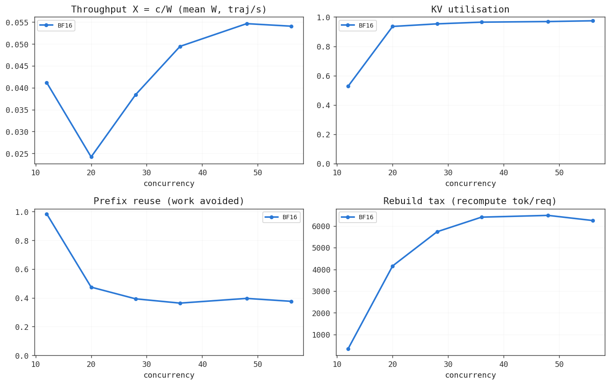

Throughput is calculated according to Little's law$^4$, telling us how many trajectories, on average, complete per second. We see a sharp drop-off in throughput once we enter the loaded regime, followed by a gradual climb as we increase concurrency. This may tempt us into cranking up concurrency to increase throughput, but we must consider the cost to the mean completion time of any individual trajectory:

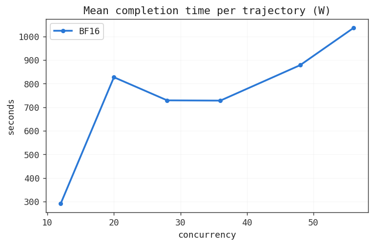

With more blocks, a given trajectory is less likely to have its own evicted while it's in a tool call. We can increase the number of available blocks by decreasing the memory usage of each individual token -- we'll do this by quantising the KV cache (we discuss model choice as another approach later). Production systems often opt to quantise to FP8 as it results in limited response quality degradation. This is achieved by setting the vLLM flag [`--kv-cache-dtype fp8_e4m3`](https://docs.vllm.ai/en/v0.6.1/quantization/fp8_e4m3_kvcache.html), reducing the memory footprint of each token to 128KiB and doubling the number of blocks we can hold in memory.

Instead of our blocks vanishing into the ether upon eviction, forcing us to recompute and stealing prefill time from other requests, we can also enable offloading via the `--kv-transfer-config` flag. Blocks can then be reloaded at request time via a prefix lookup against the connector. The experiment was ran with both 40GB and 120GB allocated to receive blocks in RAM.

We can see the achieved bandwidth didn't quite reach the theoretical 64GB/s -- this means that reloads take a bit longer than expected, which moves the threshold math in favour of tolerating longer tool-gaps than we earlier thought.

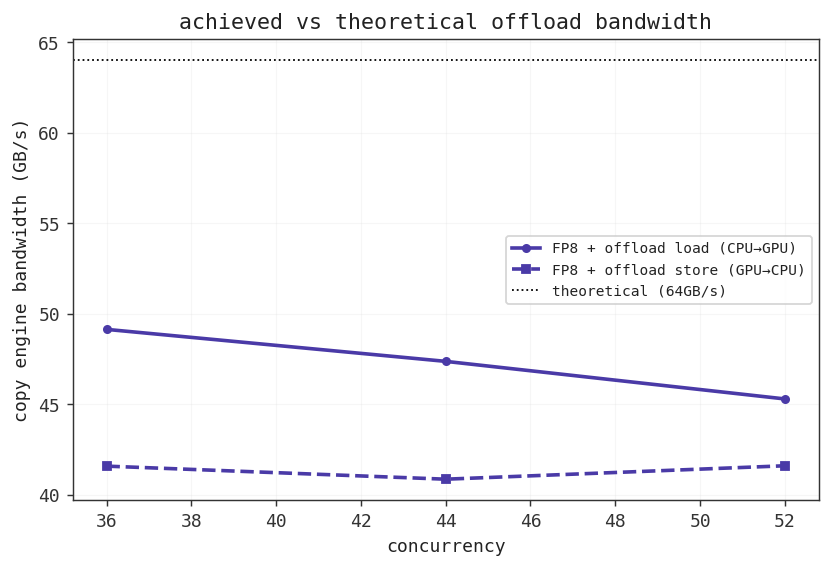

Here's what KV cache quantisation and offload/reload buys us:

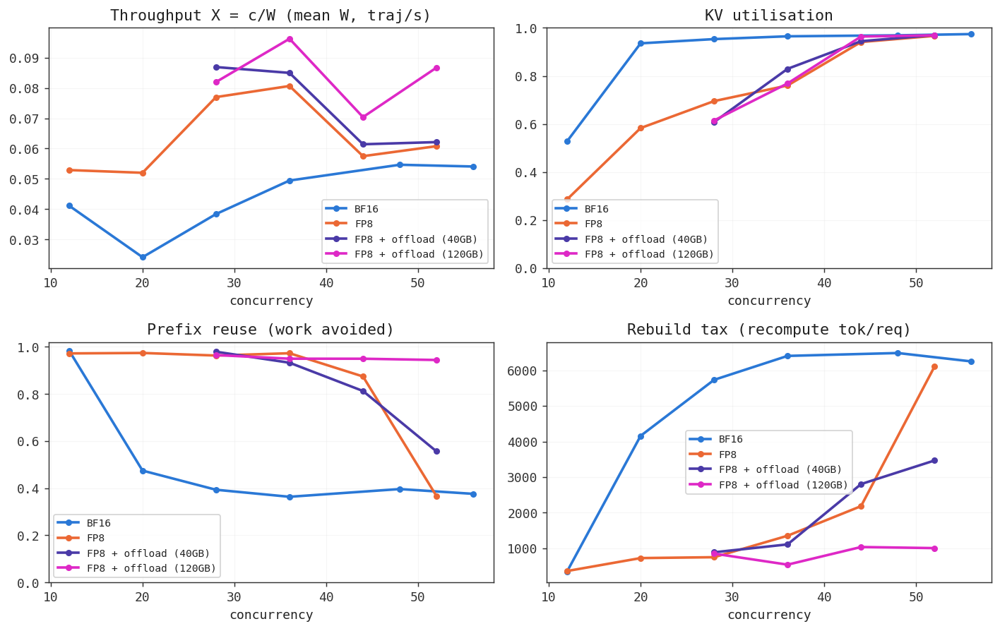

FP8 quantisation moved the elbow closer to a concurrency of around `c=40` (up from around `c=20`) and improved throughput across the arm: by reducing the footprint of each block, we increase the number we are able to keep resident -- preserving resident prefix re-use and reducing the amount of recompute required. 

Importantly, note that throughput is boosted versus BF16 even while the system was not under memory pressure, where BF16 achieves the same prefix re-use as FP8. Weights amortise cleanly across the batch: during a forward pass, the weights are loaded from VRAM to SM registers and can then be re-used for every sequence in the batch. By contrast, each sequence carries its own KV cache -- we have to load each individual to calculate attention, increasing the total time spent transferring memory. 

For prefill work, this is generally not a problem: we calculate attention over many tokens across many sequences, increasing the arithmetic intensity of each individual load and keeping the SMs busy until the next batch arrives (compute bound). Decode work requires us to calculate attention for just one token per sequence (low arithmetic intensity!) -- it takes longer to load KV tensors from VRAM into SM registers than it does to compute attention for that pass, and the SMs are left waiting for more work (memory bound). For the decode phase, quantising the KV tensors significantly reduces the number of bytes transferred, reducing the time it takes for each load and keeping the compute cores fed at a faster rate -- more attention ops per second, higher throughput$^5$.

The 40GB capacity offload arms resemble the FP8-only ones: earlier, we found that median token usage was around 15,000, yielding close to 2GB per request at the median. This means we hit capacity at around 20 resident sequences, and, since blocks are backed up *by default* while the sequence runs, this causes a cycling effect in the offload storage leading to the eviction of requests from CPU RAM at higher concurrencies, causing similar rate of prefix cache misses and recompute$^6$. By contrast, increasing the RAM allocation to 120GB and re-running yielded significantly better results: throughput climbed as prefix reuse remained close to 100% across the sweep, reducing recompute.

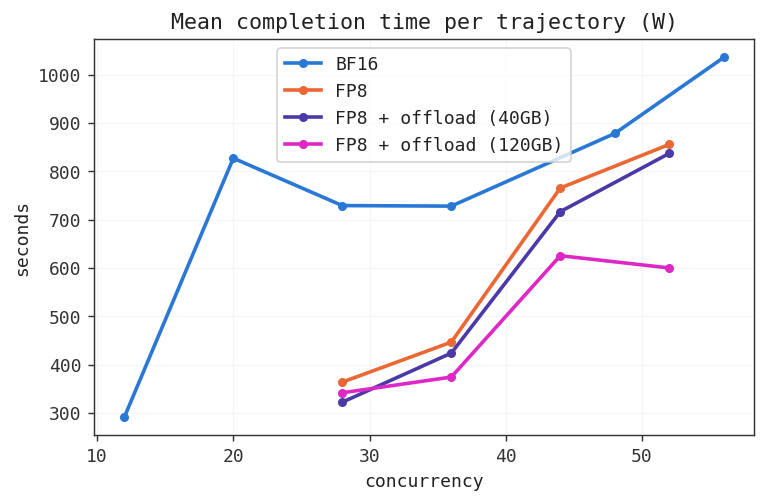

<small>$^4$$X=c/W$ where $X$ is throughput, $c$ is how many trajectories are running at once (our concurrency), and $W$ is how long one trajectory takes, measured in seconds.</small>

<small>$^5$Repeating this experiment on, e.g., an A100 (which does not support FP8 natively), you might observe a drop in throughput as FP8 KV must first be cast to BF16 within the kernel (adding latency) before any compute can happen. RTX 6000 Pro, by contrast, natively supports FP8 compute.</small>

<small>$^6$Connectors like [LMCache](https://arxiv.org/abs/2510.09665) and [Mooncake](https://www.usenix.org/system/files/fast25-qin.pdf) enable offload further up the memory hierarchy for this reason.</small>

## Leveraging Statefulness
Earlier we drew a parallel between an agent and the engine serving it, and a program being run by the kernel. That parallel also extends to memory management: a CPU-bound program has memory pages, while an agent running on an inference engine has KV cache pages. This means that we inherit a body of pre-existing optimisation literature that we can draw upon.

Thanks to my [recent travels](https://j9s.io/posts/fast_vllm/) in the Linux kernel, one technique immediately sprang to mind: [page hinting](https://man7.org/linux/man-pages/man2/madvise.2.html). Physical memory is finite, and so the OS is constantly deciding which pages stay resident in the warm cache (RAM), and which are offloaded to the cold (disk). The OS exposes this decision to userspace via advisory hints (`madvise`) -- we'll borrow a relevant subset:
- **madv_dontneed**: don't expect access in the near future -- the kernel can free the resource completely.
- **madv_willneed**: expect access in the near future -- the kernel should proactively fault the pages back in.
- **madv_pageout**: rather than waiting for memory pressure to force reclamation, evict the page now (preserving the content).

Instead of hinting the kernel about page residency, we're going to hint the vLLM scheduler about KV block residency; instead of reordering the page table, we're going to reorder the eviction queue. We'll bastardise their effect, but the goal is to protect blocks that we anticipate will have small gaps (`willneed`), prioritising eviction of those we don't think will be needed for a while (`pageout`), while evicting blocks from completed trajectories before anything else (`dontneed`). The eviction queue is then reordered as such$^7$:
```
 evicted first                                             evicted last
| dontneed | pageout | default (lru) | willneed_later | willneed_soon |
```

Our proxy keeps a record of global exponentially-weighted moving average (EWMA) gap durations by tool type$^8$, while, on a fork, we have vLLM reporting EWMA over transfer speeds. The fork also exposes an endpoint to receive hints and apply them to blocks linked to a workload via session ID, reordering the eviction queue (while protecting shared prefix blocks). Upon receiving a response, the proxy will parse it and emit a KV hint:
- If the trajectory is complete, the proxy emits a `dontneed` hint against the trajectory's blocks.
- If the response contains a tool call, it will compare the relevant tool's EWMA duration against the load time EWMA:
    - If `tool_time > load time`, assign `pageout`
    - If `tool_time < load time / 2`, assign `willneed_soon`
    - If `load time / 2 < tool_time < load time`, assign `willneed_later`

`pageout` hinted blocks are prepended rather than appended$^9$, and `willneed` blocks are given a time-to-live of `load time` before being demoted and appended to the end of the LRU queue.

We also don't want our `willneed`-hinted trajectories to sit at the rear of the admission queue (vLLM's `waiting` queue) -- by the time the request comes to be scheduled, its blocks will already have been evicted. For this reason, we enable priority-based scheduling with a `--scheduling-policy priority` flag, and have our proxy ensure that trajectories whose last turn was `willneed`-hinted are placed at the front of the admission queue. Prefix-aware scheduling falls out as a consequence.

Hints are applied post-hoc. Because our proxy and inference server were co-located, hint delivery was swift and the scheduler was only able to step once before our hints were applied -- meaning that some blocks were still evicted before the hint could be applied, resulting in a hint delivery failure:

<div class="table-row">

| Concurrency | Lag (mean, steps) | Time to apply (ms/hint) | Hint delivery failure | Samples |
|---|---|---|---|---|
| 28 | 1.002 | 2.962 | 0.18% | 557 |
| 36 | 1.000 | 1.247 | 0.34% | 573 |
| 44 | 1.000 | 1.094 | 3.25% | 620 |
| 52 | 1.000 | 0.950 | 4.39% | 667 |

<p class="caption"><em>Table 1 — Hint application lag and delivery failure rate as concurrency scales.</em></p>
</div>

<br>

<div class="table-row">

| Concurrency | Load GB/s | Load ms/token |
|---|---|---|
| 28 | 44.22 | 0.0059 |
| 36 | 51.46 | 0.0051 |
| 44 | 51.50 | 0.0051 |
| 52 | 50.63 | 0.0052 |

| Tool | c28 | c36 | c44 | c52 | n |
|---|---|---|---|---|---|
| file_editor | 130.7ms | 93.5ms | 93.7ms | 85.1ms | 2,599 |
| terminal | 927.8ms | 1357.7ms | 1047.8ms | 1240.6ms | 1,191 |
| think | 122.8ms | 83.4ms | 83.0ms | 81.9ms | 438 |

<p class="caption"><em>Table 2 — KV cache block load throughput (left) and mean inter-tool-call gap duration by tool type (right), across concurrency levels.</em></p>
</div>

`dontneed` represented the lowest share of hinted blocks -- expected, as trajectories complete only once (though with full context) -- while `pageout` and `willneed` were determined with each tool call. `pageout` represented the highest share of hints, explained by the per-tool mean gap durations compared against early-trajectory lower reload costs; `willneed` represented a fair share, explained by later-stage trajectories with larger contexts, and short tool durations.

<div class="table-row">

| Concurrency | willneed | dontneed | pageout | n (total blocks) |
|---|---|---|---|---|
| 28 | 39.22% | 10.11% | 50.67% | 421,372 |
| 36 | 30.43% | 8.98% | 60.60% | 355,615 |
| 44 | 32.21% | 9.63% | 58.17% | 490,456 |
| 52 | 34.99% | 9.34% | 55.67% | 333,818 |

<p class="caption"><em>Table 3 — Share of hint types among total hinted blocks, by concurrency.</em></p>
</div>


A request at the front of the admission queue could expect to wait a median of around 2.5 seconds$^{10}$, by which point the `willneed` hint had expired, demoting blocks to the back of the LRU queue. However, judging by the uplift of local (GPU) prefix hits versus the shadow run, `dontneed` and `pageout` blocks provided a buffer such that at least some `willneed` blocks were protected from eviction, meaning returning `willneed` trajectories had blocks still resident in VRAM, thereby reducing reload cost.

<div class="table-row">

| Concurrency | Hinted (GPU-local) | Shadow (GPU-local) | Uplift |
|---|---|---|---|
| 28 | 34.51% | 23.92% | **1.44x** |
| 36 | 32.04% | 24.59% | **1.30x** |
| 44 | 30.34% | 28.55% | **1.06x** |
| 52 | 35.79% | 28.80% | **1.24x** |

<p class="caption"><em>Table 4 — GPU-local hit rate for hinted vs. shadow (unhinted) requests, with uplift.</em></p>
</div>

This appears to have translated into a modest uplift in throughput:

<div class="table-row">

| Concurrency | W hinted (s) | W shadow (s) | X hinted (traj/s) | X shadow (traj/s) | Uplift |
|---|---|---|---|---|---|
| 28 | 587.9 | 716.2 | 0.0476 | 0.0391 | **1.22x** |
| 36 | 567.1 | 721.5 | 0.0635 | 0.0499 | **1.27x** |
| 44 | 752.3 | 873.2 | 0.0585 | 0.0504 | **1.16x** |
| 52 | 848.0 | 877.8 | 0.0613 | 0.0592 | **1.04x** |
<p class="caption"><em>Table 4 — Mean trajectory length ($W$) and throughput ($X=c/W$) for hinted vs. shadow (unhinted) requests, with uplift.</em></p>
</div>
<br>
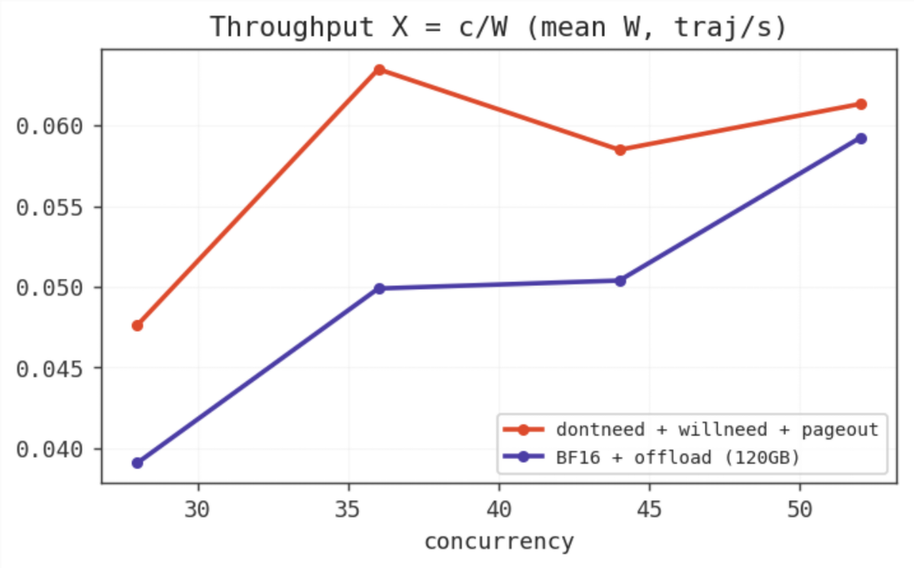

However, these results are confounded by higher achieved load speeds: if blocks load from CPU RAM to VRAM more quickly, less time is spent with idle memory in the inference engine, which could also explain increased throughput. Though, it is important to note that `c=28` achieved lower load speeds while still achieving higher throughput -- but this could be explained by run-to-run variation. Ultimately, repeat (and controlled) experiments are required to determine the true efficacy of the approach and rule out both the bandwidth hypothesis and random variation.

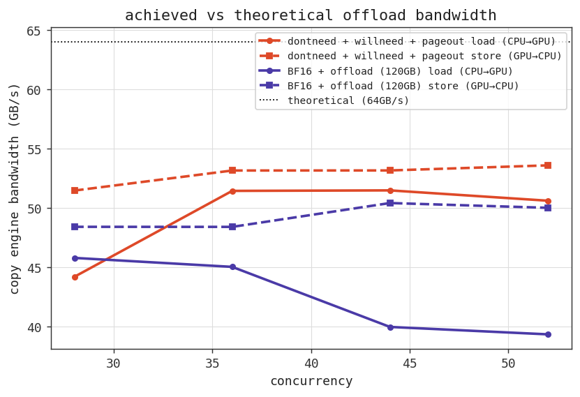

Without producing any statistically significant results, I hope this section has been able to paint an image of how we might leverage state as a means to optimise KV cache memory usage to increase throughput for agentic workloads. To prove that state isn't a spurious lever, I'll highlight the achievements of some other approaches that leverage state from the literature:
- **Continuum**: Similar concept, but hard pins the KV cache in memory, achieving 1.10x-3.22x throughput improvement, 1.12x-3.66x delay reduction.
- **TokenCake**: Event-driven CPU offload, with speculative re-upload with per-function EWMA. Up to 47.06% reduction in end-to-end completion time. 
- **CacheWise**: Prefix-overlap scheduling with predicted time to next reuse for each block. 2-2.6x reduction in KV cache eviction vs. vLLM baseline, and up to 3.5x improvement in end-to-end session completion time.
- **KVFlow**: Uses a DAG of the agentic system to compute steps-to-execution per agent, then prefetches ahead. Up to 2.19x end-to-end workflow speedup under high concurrency.
- **Autellix**: Program-level least-attained-service (LAS) scheduling, tackling head of line blocking. Up to 8x throughput versus vanilla vLLM.

So state is valuable, and can be used to significantly improve serving for agentic workloads. To wrap up, I'll talk about some other ways we can optimise the memory usage of our KV cache via model selection and parallelism strategies.

<small>$^7$The default (LRU) queue is maintained for the case of unhinted blocks (chat requests), while we split `willneed` into two buckets (`transfer time / 2.0`) to maintain some level of order in O(1) time (reclaiming a block returning in `transfer time - 1` ms is strictly better than reclaiming one returning in 0.1ms).</small>

<small>$^8$I also considered local (within-trajectory) EWMA, but task identity explained little of gap variance, so we'd essentially recover global EWMA. Separately, I also tried to determine if the LLM could accurately predict its own gap duration (with and without feedback from prior prediction vs. actual): it systematically overestimated by a considerable factor, and so the approach was dropped.</small>

<small>$^9$This decision was made with the expectation that older blocks are probably closer to resumption than new blocks -- though it's a coarse approach.</small>

<small>$^{10}$Calculated using Little's law $X=c/W$ against the admission queue: `c` is the queue depth and `W` is the mean queue time (`queue_time_s_mean`, from vLLM metrics).</small>


## Other Optimisations
We also have a few more levers we can pull to reduce memory pressure, allowing us to admit more concurrent requests and driving up throughput.

#### Attention Variants
Let's turn back to the KV math we used earlier to calculate our memory cost per token:
$$
\text{bytes per token} = 2 \times \text{num\_layers} \times \text{num\_kv\_heads} \times \text{head\_dim} \times \text{bytes\_per\_element}
$$
For vanilla multi-head attention (MHA), cache size grows with the number of tokens in the sequence. However, we can also consider other variants, which take different approaches to managing context. Let's take a look. 

We can reduce the cost per token:
- **Multi-query attention (MQA)**: All query heads read from just one shared K/V head.
- **Grouped-query attention (GQA)**: Query heads are split into `n` groups, each group sharing one KV head. Memory usage scales with `n`.
- **Multi-head latent attention (MLA)**: K and V vectors are jointly compressed into one latent vector, and then projected back to per-head KV at attention time. We store the latent instead of two full K and V tensors.

Or we can reduce the cost by context length:
- **Sliding window attention**: Each token attends only to the previous `n` tokens instead of the full prefix. Bytes per token remains unchanged, but the cache becomes a fixed-size ring buffer of `n` entries per layer instead of growing with sequence length. Caps compute at O(seq_len x W) versus vanilla attention's O(seq_len^2). Often used in conjunction with full-sequence attention.
- **Linear attention/state-space models** (e.g., Gated DeltaNet, Mamba): Uses a fixed-size recurrent state stored as a running sum rather than a cache that grows with sequence length. Often used as a hybrid with full attention. O(1) per decode step (we need only consider the recurrent state) versus vanilla attention's O(seq_len) (attend over all prior context).

Thus, we can reduce our memory footprint simply by being smart about which model we use to carry out agentic work. We can further juice the model quality without adding to the KV footprint by choosing a mixture-of-experts (MoE) architecture: MoE only touches feed-forward layers, leaving attention untouched -- and therefore KV cache -- while giving us better performance per active parameter.

#### Parallelism
Another obvious choice to increase the number of requests we can admit at any given point (thereby boosting throughput) is to simply increase the number of GPUs on which we host our model. We have a few options:
- [**Data parallelism**](https://huggingface.co/spaces/nanotron/ultrascale-playbook?section=data_parallelism): Replicate the model on each GPU. Aggregate throughput scales with GPU count. We pay the full cost of holding a replica in VRAM, allowing less room for KV cache.
- [**Tensor parallelism**](https://huggingface.co/spaces/nanotron/ultrascale-playbook?section=tensor_parallelism): Shard weights and KV (generally across head dim) tensors across a group of GPUs. Because we only hold a portion of each, we allow more room for KV cache. This comes at the cost of a per-layer all-reduce each forward pass, and is bounded by NVLink/NVSwitch speeds. Alternating column-parallel/row-parallel ([Megatron](https://arxiv.org/abs/1909.08053) style) splits requires 2 all-reduces per layer in the forward pass, costing $4L(t-1)$ hops across $L$ layers and $t$ ranks. Cross-node is less feasible as the sync cost jumps by an order of magnitude. Care must be taken with latent attention variants, as sharding along the head dimension would require us to materialise the KV on each GPU, eating the memory saving.
- [**Pipeline parallelism**](https://huggingface.co/spaces/nanotron/ultrascale-playbook?section=pipeline_parallelism): Shard layers rather than tensors. Again, allows us more room per GPU for KV cache. Requires only point-to-point handoff of activations between each stage costing $p-1$ hops with $p$ stages. Comes at the cost of bubble overhead if arrivals aren't sufficiently quick (ranks left idle waiting for activations).
- [**Expert parallelism**](https://huggingface.co/spaces/nanotron/ultrascale-playbook?section=expert_parallelism): Only relevant if we're using MoE architecture -- shard experts across GPUs, leaving us more room for KV cache.

## Conclusion
Throughput can be driven by reducing the memory footprint of each request's KV cache, allowing us to admit more concurrent requests. We can do this through quantisation, offloading, model selection, parallelism techniques, and, importantly for agentic workloads, by using information about the agent's state to make better informed decisions about routing, admission, and eviction.