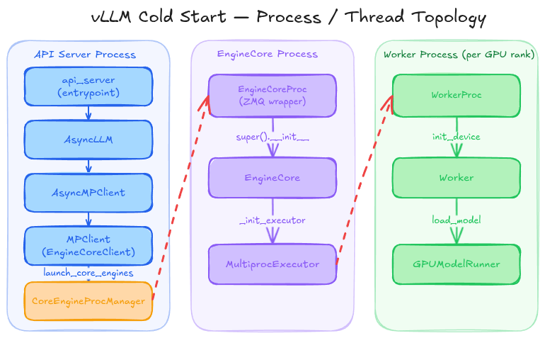
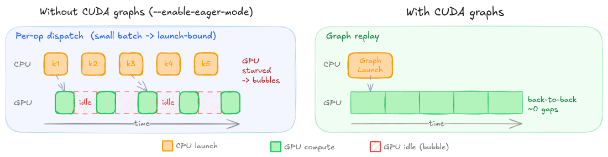
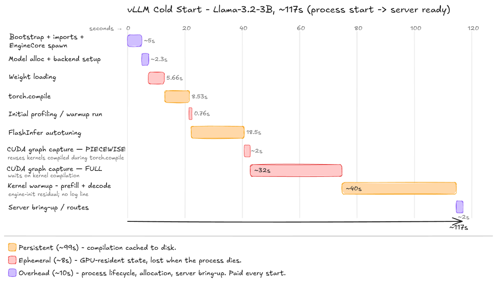
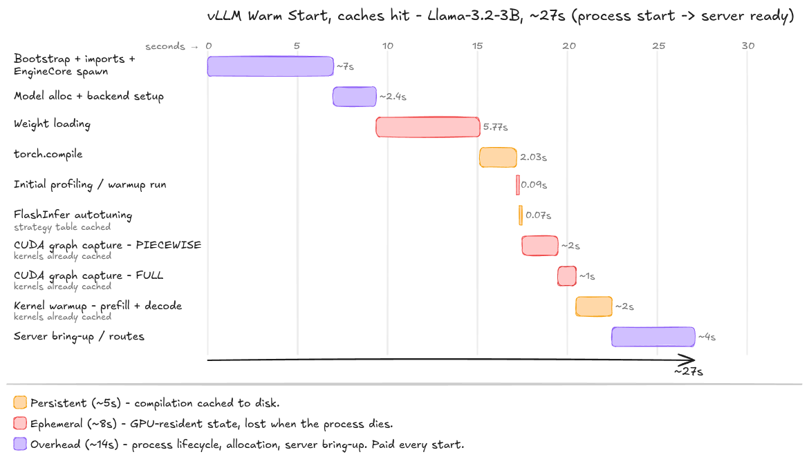
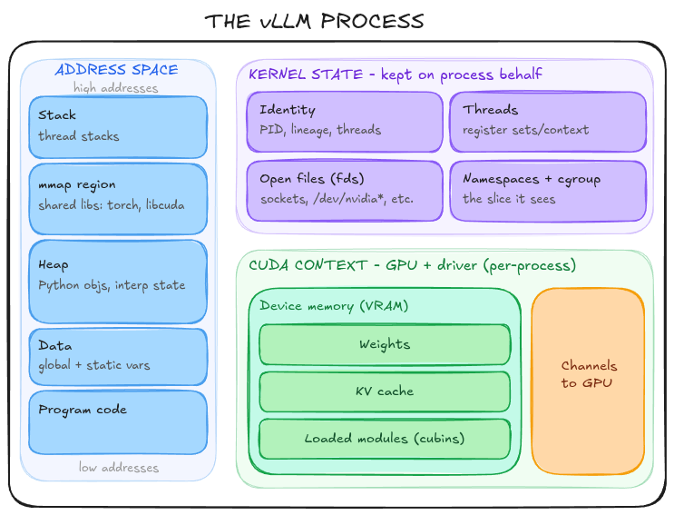
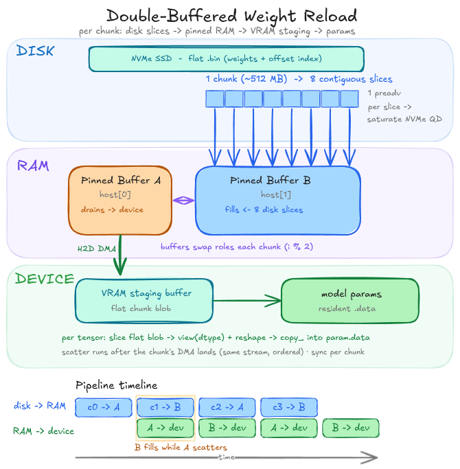

+++
date = '2026-05-17T16:36:24+01:00'
draft = false
title = 'Fast vLLM: Reducing container cold-start time by 20x [WIP]'
summary = 'Reducing container start-up time from 117s to 6s.'
+++
---
This post is still a working piece.

[doubleword's work](https://blog.doubleword.ai/fast-sglang-starts) heavily influenced this process.

---

## Cold Start



The meat of the work is performed within the [`Worker`](https://github.com/vllm-project/vllm/blob/c6741b2ad48a46e87d2cce35d113c4ae0950af91/vllm/v1/worker/gpu_worker.py#L124) and the [`GPUModelRunner`](https://github.com/vllm-project/vllm/blob/c6741b2ad48a46e87d2cce35d113c4ae0950af91/vllm/v1/worker/gpu_model_runner.py#L421).

The `GPUModelRunner` uses a loader to [build the model architecture](https://github.com/vllm-project/vllm/blob/c6741b2ad48a46e87d2cce35d113c4ae0950af91/vllm/v1/worker/gpu_model_runner.py#L5163) from config directly on-device, and has tensors allocated in GPU memory ready to receive parameters. The loader then populates these addresses by passing a [weight iterator](https://github.com/vllm-project/vllm/blob/c6741b2ad48a46e87d2cce35d113c4ae0950af91/vllm/model_executor/model_loader/default_loader.py#L321), which wraps the safetensors pre-downloaded from Huggingface, to the loaded model's weight loader. The loader [iterates over each tuple](https://github.com/vllm-project/vllm/blob/c6741b2ad48a46e87d2cce35d113c4ae0950af91/vllm/model_executor/models/llama.py#L456) `(name, loaded_weight)` in the iterator, copying each parameter into its destination address. Ultimately, in the simplest case (ignoring book-keeping), [weight loading](https://github.com/vllm-project/vllm/blob/c6741b2ad48a46e87d2cce35d113c4ae0950af91/vllm/model_executor/model_loader/weight_utils.py#L1198) amounts to:

```python
for name, loaded_weight in weight_iterator:
  param.data.copy_(loaded_weight)
```

This performs a PyTorch in-place copy, which under the hood dispatches to `cudaMemcpyAsync` -- per-tensor -- and then waits on `cudaStreamSynchronize` (blocking). Worse, the parameters are present in pageable memory, and so must first be [staged in a pinned buffer before being transferred to GPU](https://docs.pytorch.org/tutorials/intermediate/pinmem_nonblock.html). Each individual `copy_` incurs:
- CUDA API call overhead *per tensor*,
- a copy into a pinned buffer on host before DMA to device,
- no opportunity for CUDA runtime to coalesce the transfers (sad for PCIe),
- and the CPU blocks on each transfer before the Python loop is able to advance to the next tensor.

 This should be setting off alarm bells for any self-respecting inference engineer -- we're left with hundreds of small transfers with overhead between each. But we'll put a pin in that for now, and come back to it later.

For now, we have our first metric: Weight loading (**5.66s**). 

Is that good? Let's check disk read speed (NVMe is our bottleneck). 
```bash
sudo fio --name=max-read 
  --filename=/dev/nvme0n1 
  --rw=read 
  --bs=1M # large blocks
  --iodepth=32 # saturates NVMe queue
  --direct=1 # bypass page cache (cold start!)
  --ioengine=libaio # enables async i/o to leverage queue depth
  --runtime=10 
  --time_based
```
For my disk, this yields around 3764MB/s. Our weights are ~6GB; my theoretical minimum is **1.6s**. Not great. Onwards.

Next, we need to [initialise the KV cache](https://github.com/vllm-project/vllm/blob/c6741b2ad48a46e87d2cce35d113c4ae0950af91/vllm/v1/engine/core.py#L133). To determine how much room (DRAM) we can allocate to the KV cache, vLLM performs a [dummy forward pass](https://github.com/vllm-project/vllm/blob/c6741b2ad48a46e87d2cce35d113c4ae0950af91/vllm/v1/worker/gpu_model_runner.py#L5678) at the `max_seq_len`/`max_num_batched_tokens`, [capturing the peak memory utilisation](https://github.com/vllm-project/vllm/blob/c6741b2ad48a46e87d2cce35d113c4ae0950af91/vllm/v1/worker/gpu_worker.py#L407) of the model -- anything that remains is fair game for the KV cache.

We have a model and its weights loaded and ready to go; we also have initialised the KV cache so we can start playing with tokens. It might be sufficient to stop there if we were not working with a *high-throughput and memory-efficient inference and serving engine for LLMs*. Yes, we can run inference -- no, it won't be very fast. So how do we get there?

This is where vLLM starts to earn its keep. We'll address each in turn:
1. torch.compile
2. FlashInfer
3. Pre-emptive kernel compilation
4. CUDA Graphs

#### torch.compile
If you've spent any amount of time in deep learning codebases, you've probably come across [torch.compile](https://github.com/vllm-project/vllm/blob/c6741b2ad48a46e87d2cce35d113c4ae0950af91/vllm/compilation/decorators.py#L118) -- you might not know what it is, but you've heard of it. You probably also know that Python is slow (relatively speaking). PyTorch's eager execution mode has overhead on every operation: dispatch, type checking, kernel selection, argument validation, etc. -- all of it runs on the CPU before a single kernel launches. torch.compile attacks this overhead, and is actually two things:
1. **Dynamo**: a Python bytecode (`.pyc`) interceptor. Instead of running `forward()` normally, it intercepts it at the bytecode level and traces it into a graph representation of the operations. If it hits something it can't break (like a function decorated with `@triton.jit`), it breaks the graph and falls back to eager execution for that segment. This is a good place to note that the heavy operations in vLLM (attention, matmuls, etc.) are handled outside of torch.compile; only the scaffolding between these is optimised.
2. **Inductor**: takes the graph built by Dynamo and compiles it into optimised code. Primarily, it uses operator fusion which leads to dispatch elimination; where eager mode may dispatch separate kernels for a linear layer, a bias addition, and an activation function (each with its own launch overhead and **memory round-trip**), Inductor fuses them into a single kernel and also generates Triton kernels (see below) for the fused ops.

Given the same configuration, torch.compile will always produce the same optimised kernels. vLLM exploits this by caching the output to `~/.cache/vllm/torch_compile_cache`, keyed on a hash of the config.

This brings us to our next metric: torch.compile (**8.53s**).

#### FlashInfer
Attention is the most expensive operation in the forward pass, and its cost profile looks nothing like training. At inference, we handle mixed batches -- some sequences prefilling (processing prompt tokens in parallel; dense matrix-multiplies), others decoding (generating one token at a time; matrix-vector multiplies) -- each with variable configurations (head dimensions, GQA ratios, datatypes, etc.). A general purpose attention kernel won't cut it. 

FlashInfer is an attention kernel library tailored specifically for inference workloads. It provides hand-tuned, pre-compiled attention kernels that covers the combinatorial space of inference attention. For any given configuration, there may be several valid kernel variants. [FlashInfer uses an autotuner](https://github.com/vllm-project/vllm/blob/c6741b2ad48a46e87d2cce35d113c4ae0950af91/vllm/model_executor/warmup/kernel_warmup.py#L119) to benchmark the viable kernels against each other, and then stores the optimal tactic for each shape. Again, the results are cached to `~/.cache/flashinfer`, and can be re-used with the same configuration.

This is a (relatively) time-consuming process, taking **18.5s** in our experiment.

#### Pre-emptive Kernel Compilation
It's important to note that each time the model runs a forward pass, new kernels are (probably) compiled. Two things happen under the hood: functions decorated with `@triton.jit` are hit, and direct calls are made to library kernels (cuBLAS, cuDNN, etc.). The function of pre-emptive kernel compilation is to ensure that no unexpected compilation happens during live inference.

Compilation runs at a set of pre-defined shapes (e.g., `seq_len=[1024, 2048, ...]`) -- a quick but important aside on what 'shape' means in this context: vLLM processes a batch of requests as a single 1-dimensional tensor; sequences are flattened end-to-end into one flat buffer, and attention masking ensures that each sequence only attends to itself. The dimension that varies, then, is the total token count in that flat buffer. At runtime an incoming batch is padded to the nearest one so that it can reuse the kernels already compiled for that size (e.g., a flat length of 1017 pads up to a compiled 1024). 

Though compilation is interleaved throughout the startup process, it is broadly focussed in two distinct phases:
1. [**Profiling runs**](https://github.com/vllm-project/vllm/blob/c6741b2ad48a46e87d2cce35d113c4ae0950af91/vllm/v1/worker/gpu_worker.py#L701): forward passes run across the range of pre-defined shapes, exercising the model's main forward path (GEMMs, fused Triton kernels that Inductor generated, RMSNorm, RoPE, etc.). On each pass, when we hit `triton.jit` or make a library call with a new shape, another kernel gets compiled.
2. [**Kernel warmup**](https://github.com/vllm-project/vllm/blob/main/vllm/v1/worker/gpu/warmup.py#L153): happens at the very end. Profiling runs are not representative of deployment inference loads: they use placeholder metadata, where slot mappings are set to `-1` so that KV writes hit an invalid slot and skip; empty attention metadata, and no sampling occurs. The kernel warmup stage runs the *full* execution path on representative prefill and decode workloads to hit the missed kernels: KV cache read/write kernels, sampling kernels, structured-output bitmask kernels, spec-dec kernels, etc. It's the complement of the profiling runs, touching on everything they deliberately skipped. This stage measured **~40s** in our experiment.

When a `triton.jit` function is hit, Triton compiles the source code in order through:
1. **Triton IR**: thread-agnostic, operating purely in terms of blocks of elements.
2. **Triton GPU IR**: introduces the GPU execution model, mapping from blocks of elements down to warps and threads.
3. **LLVM IR**: Triton uses LLVM's NVPTX backend, allowing Triton to leverage LLVM's decades of compiler optimisations (loop optimisation, instruction selection, etc.).
4. **PTX**: NVIDIA's virtual ISA (instruction set architecture), architecture-agnostic.

Below, we can see an interactive visualisation of the interim stages a compilation of a Triton RMS Norm kernel, very handily produced by Claude.
<iframe
  src="/widgets/triton-explorer/index.html"
  style="width:100%;height:680px;border:none;border-radius:8px;"
  loading="lazy">
</iframe>

The resulting PTX is cached keyed on a hash of the bytecode and specialisation constants (block size, etc.), and stored in `~/.triton`. At runtime, the Triton-compiled PTX and the PTX of library kernels is compiled to SASS through the CUDA driver:

5. **SASS**: NVIDIA's equivalent of machine code; architecture-specific (will only work on the arch it has been compiled for) and microarchitecture-aware (can take advantage e.g. of Blackwell's tensor cores). 

Similarly, the SASS is cached too, keyed on the PTX hash and the SM version, and stored in `~/.nv/ComputeCache`.

With potentially hundreds of unique compilations across a model, and with each PTX to SASS compilation being non-trivial, this amounts to a serious bottleneck. Worth paying upfront, because inference can now run at arbitrary shapes without unexpected compilations causing latency spikes. Moreover, it's all cached for next time.

By now, we have complete (and compiled) sequences of kernels that are executed in the forward pass. And we can fairly comfortably assume that these sequences are fixed for their corresponding shapes. Now, remember what we said about launch overhead?

#### CUDA Graphs
While torch.compile largely tackled launch overhead by reducing the *number* of kernels, CUDA graphs tackle what remains: the cost of issuing each surviving launch. Instead of the CPU walking the sequence and firing kernels one at a time -- each requiring a separate trip across the CUDA API -- the entire sequence is captured once and replayed as a single operation.

If you're questioning 'what if the GPU takes longer to complete than the CPU does to queue the next kernel?', then you have touched on exactly why CUDA graphs are only captured for smaller sequences. Kernel launches are asynchronous: normally the CPU runs ahead of the GPU, keeping the stream's buffer full, but at smaller sequence sizes (e.g., `seq_len < 512 tokens`), each kernel runs for so little time that the GPU drains the queue faster than the CPU is able to refill it: the per-launch overhead is large relative to the compute time (launch-bound). If you were to visualise a trace of this execution, you might see something like the left-hand side of the image below: bubbles of idle time (bad) on the GPU between each kernel launch. For larger sequences, arithmetic intensity rises and per-kernel duration grows, so the fixed cost is amortised.

For smaller tensors, [the forward pass is recorded](https://github.com/vllm-project/vllm/blob/main/vllm/v1/worker/gpu/cudagraph_utils.py#L261) at each capture size (e.g., `seq_len=[32, 64, 128, 256, 512]`). It is important to note that these shapes do not overlap with those encountered during the earlier profiling runs -- as such, kernel compilation will occur for these smaller shapes. Each pass produces a static sequence (specifically a directed acyclic graph) of CUDA operations that can be replayed directly *without* the per-operation kernel dispatch overhead.  At inference, incoming batches are padded and the corresponding graph replayed, almost entirely eliminating the CPU-side dispatch cost. The right-hand side of the below image illustrates this point.



Each node in the graph stores the kernel launch configuration and argument values -- importantly, this also includes actual device addresses (pointers), meaning that if tensors are re-allocated to different addresses (such as on restart), the graph cannot be reused as the nodes point to stale addresses. This means that the graphs must be re-captured -- though they *can* take advantage of the previously cached kernels -- each and every startup.

This phase took a total of **34s** (most of which is kernel compilation).

### Summary: Cold Starts
That's everything done -- we're finally ready to start inference. We have:
- Our model loaded and ready on-device;
- fused operations, improving arithmetic intensity for loaded data, also reducing the number of dispatches (and associated overhead) required;
- selected the optimal attention kernel strategy;
- readied high-performance kernels for any shape a workload could throw at them;
- captured CUDA graphs to eliminate pipeline bubbles caused by dispatch overhead for smaller workloads.

vLLM has finally earned the 'high-throughput and memory-efficient inference and serving engine for LLMs' tagline. But it took a while -- **117 seconds!**

Here's where the time went:
 


Now we're finally ready to start whittling it down. Remember our container is ephemeral: any state accumulated during runtime is discarded when we shut the container down -- unless we tell it not to.

## Whittling it down
The most obvious place to start (and this is going to land a bit cheaply) is to simply **persist our cache folders on disk, and remount them into subsequent containers**. This is achieved with a couple of Docker CLI args:
```bash
  -v ~/.cache/huggingface:/root/.cache/huggingface \  # Downloaded weights
  -v ~/.cache/vllm:/root/.cache/vllm \                # torch.compile cache
  -v ~/.triton:/root/.triton \                        # Compiled Triton kernels (PTX)
  -v ~/.cache/flashinfer:/root/.cache/flashinfer \    # FlashInfer strategy tables
  -v ~/.nv:/root/.nv \                                # Compiled kernels (SASS)
```

This is a pretty easy, if not satisfying, win. We've managed to knock 90 seconds off our start-up time, reducing from 117s to **~27s**, just by re-using our caches.



27 seconds is still a long time to wait. Notice that a big chunk of our time is largely overhead, and despite loading from cache, none of the stages have collapsed to zero time. So where do we go from here?

Firstly, I'd like to step back and take a quick detour. I'd like to discuss what vLLM actually is: a process.

#### The Process
And what is a process? It's essentially a state that exists across three locations:
1. **The process's own memory**: the address space. A set of virtual memory areas, each a range of addresses that have associated permissions (e.g., read, write, execute) and backing (e.g., anonymous, file-backed). It contains the code mapped from the running executable, the initialised data (think static and global vars -- allocated once and persisted), the heap (grown on demand and carved up via `malloc`; user-managed memory), a per-thread stack (local vars, current execution context, function args, etc.), and the `mmap` region where shared libraries (`.so` files, like Python runtime, libcuda, libtorch, etc.) are parked by the dynamic linker at startup.
2. **The kernel, on the process's behalf**: the kernel maintains a `task_struct` (one per thread) and associated structures that collectively describe everything that the process *is* to the OS:
    - Identity and lineage -- PID (process ID), parent's PID, process group, session ID, thread IDs.
    - Per-thread execution context -- the saved register set for each thread when it's not scheduled (this is what gets restored on context switch)
    - Open file table -- a set of file descriptors, where each fd is a process-side handle into a kernel-side struct, which in turn points to a file, socket, pipe, etc. This covers things like stdin/stdout/stderr, sockets, device files, everything. Think of it as the kernel's process I/O interface.
    - Filesystem context -- current working directory, root directory.
    - Credentials and security -- user and group IDs, and their associated capability sets (what privileged operations the process can perform).
    - Namespaces and cgroups -- which PID/mounts/network/etc. namespaces the process belongs to (what slice of the system the process can see), and its cgroup membership (which governs CPU, memory, and I/O limits). These two are together what makes a container a container: namespaces provides isolation from the host machine, while cgroups provide resource enforcement.
3. **A device and its driver**: in our case, a GPU. This includes the device memory (VRAM allocations), loaded modules (compiled kernels/cubins), and the CUDA context -- we'll touch on this later.

So, what is a process? It's the complete bundle of state tied to a thread group: its memory and the bytes in it, each thread's execution context, its file-descriptor table and the live (OS) kernel objects behind each entry, its signals, credentials, and security context, its limits and scheduling state, its namespace and cgroup memberships, and its IPC objects -- split across the process's own memory and the kernel's book-keeping, with, in our case, a slab of state out on the GPU besides. Let's see how vLLM maps onto this model.

#### Imports
Firstly, we'll consider how a Python process is actually loaded. Once the Python interpreter has bootstrapped itself into existence (taking roughly 10-30ms), it begins to run the top-level functions of each module (`.py` file). The first thing we hit are [imports](https://docs.python.org/3/reference/import.html). Let's run through what happens when it reaches `import torch`:
1. `sys.modules`, an object containing every module built so far, is checked to see if `torch` has already been loaded (de-duplication); if it is, the existing object is passed and the interpreter skips.
2. If not, the interpreter walks the directories listed in `sys.path` (heard of 'on PATH'?) one by one; the first time it looks in a given directory, it caches the list of files. If the dir doesn't contain `torch`, it errors, and moves on.
3. When found, the interpreter looks for a pre-compiled copy in `__pycache__`. If the cache is a hit, it loads the bytecode from the `.pyc` file. If not, it compiles and writes a fresh `.pyc`.
4. The interpreter runs the top-level functions of the imported module; most contain more imports, and this process cascades again. Compiled extensions (`.so`/`.dll` libraries) are attached to the live process via `dlopen` (this is contrasted against the dynamic linker which performs a similar function at startup); `dlopen` finds the library, then `mmap`s the segments into the process's address space and initialises them. For `torch`, this eventually pulls in the C++ core, and GPU libraries like cuBLAS or cuDNN.
5. As each submodule is scanned by the interpreter, the module object is completed in `sys.modules`; the `torch` module is fully built, and bound in `main.py`'s namespace.

vLLM will pay the import cost once, at startup, and then forks the worker processes which inherited the imported state.

We can see where the time is spent performing `import torch` via a simple bash experiment using `strace` (Linux syscall tracer):
```bash
echo "import torch" > main.py
strace -c -f python3 main.py 2> strace_summary.txt  
cat strace_summary.txt
```

```bash
# strace_summary.txt
% time     seconds  usecs/call     calls    errors syscall  
------ ----------- ----------- --------- --------- -----------------------  
97.62    1.070441       13054        82           futex  
 1.07    0.011746           0     13504       687 newfstatat  
 0.49    0.005413           2      2270       924 openat  
 0.35    0.003861           1      2423           read  
 0.08    0.000900           0      1302           mmap  
 0.07    0.000748           0      2417           fstat  
 0.07    0.000724           0       980           munmap  
 0.05    0.000521           0      2167         3 lseek  
 0.04    0.000471           0      1348           close  
 0.04    0.000460           1       342           getdents64  
 0.04    0.000459           0       781           brk  
 0.03    0.000363           0      1102      1097 ioctl  
...
------ ----------- ----------- --------- --------- -----------------------  
100.00    1.096550          37     29079      2716 total
```

Just importing `torch` takes one second -- doesn't sound like much, but have you seen how many imports vLLM has? Ignoring the `futex` (mostly threads waiting on each other), we can see where the time goes:
1. A lot of searching the disk:
    - `newfstatat` -- fetch a file's metadata by path (does it exist, if so what is it).
    - `openat` -- opening files. Note that when it tries to open a file that doesn't exist it errors (time wasted! 924 times)
    - `read` -- copies bytes from file into memory.
2. And some loading:
    - `mmap` -- map a file/region into memory (this is the libraries being brought up).
    - `munmap` -- unmap.
    - `brk` -- grow the heap.

This import sequence produces in-memory state that belongs to the process: the module objects (like `torch`) live on the process's heap, and the shared libraries (libcuda, libtorch, etc.) live in the `mmap` region. This state is rebuilt from scratch on every start, and is steady once built. The state we rebuild each time is essentially identical -- we reuse the same recipe.

#### CUDA Context
Once the imports (importantly `torch`) are loaded, we ask the CUDA driver to bring the device up. CUDA does this lazily, meaning it will not open up a CUDA context until the first call that requires the GPU.

CUDA context is essentially the GPU-side equivalent of a process's address space. On the CPU side, a process has its own private memory map, loaded code, and open resources; a CUDA context is the *per-process* container holding the equivalents on device: GPU allocations, loaded kernels, and the channels that link the host to the hardware. The host manages the device through file descriptors to `/dev/nvidiactl` and `/dev/nvidia*`. All communication is performed through the [`ioctl`](https://man7.org/linux/man-pages/man2/ioctl.2.html) syscall, which takes a file descriptor, a command code, and a payload, and leaves the interpretation to the driver. The NVIDIA driver defines its own command vocabulary, performing allocations, kernel launches, etc. encoded as `ioctl` calls. GPU memory allocated through this interface gets mapped into the host process's virtual address space, appearing alongside the heap and `mmap` segments in `/proc/<pid>/maps`, and so the CPU is able to directly address it via ordinary pointers.

Every process that uses the GPU gets its own context per device -- a live connection split across the process, the kernel driver, and the GPU, all keyed to the process. Therefore, it is ephemeral -- and recreated at each startup.

#### Weights & KV Cache
The full cost of initialisation is paid every startup. Weights and KV cache are present in device memory.

#### Cache Reuse
We've just seen how we can re-use caches to eliminated the costs associated with compilation. However, not one of them eliminates the cost of having to load the result into a live process:
- **Disk to host transfer**: reading the cached cubins (NVIDIA), Inductor-generated `.so` files, FlashInfer tactic tables. Each must be loaded from disk into memory.
- **Into the address space**: the host-side compiled pieces (e.g., Inductor's C++ wrapper) are `.so`s, so they are loaded via `dlopen`: mapped in and initialised.
- **Into device and context**: actual GPU code (like cached SASS) has to be loaded onto device and registered in the context through the driver's module loading path.

Specifically: 
- **Triton `(~/.triton)` + SASS (`~/.nv/ComputeCache`)**: first hit of a `triton.jit` kernel at warmup finds the cached artefact and skips the compile, but still has to load the module into the context and set up the Python-side launcher. Metadata on the heap, kernels in device memory.
- **torch.compile**: cache hit skips the Inductor codegen and the C++ compile, but we still have to deserialise the artefacts, `dlopen` the generated wrapper, wire it back into the forward pass, and load the Inductor-generated Triton kernels (see above). Metadata on the heap, kernels in device memory, and `.so`s in the `mmap` region.
- **FlashInfer**: tactic-table lookup. The selected kernels still have to be loaded into the context. Metadata on the heap, kernels in device memory.

This can mean loading hundreds of files. While each may be small, the cost of making many small calls with fixed overhead, serially, adds up. Again, we're paying this cost every time.

#### OS Kernel State
The OS kernel maintains book-keeping about the running threads via the `task_struct` and the kernel objects that are attached to it. The vLLM process is essentially a bundle of many threads, each performing different tasks: asynchronous event loops, threads servicing ZMQ channels, the engine, the workers, etc. 

The kernel holds an execution context for each thread. When a thread isn't scheduled, the kernel holds a snapshot that is required to restore it exactly to its previous state. That includes general purpose registers, the instruction pointer (where the thread resumes), the stack and base pointers (where its memory lives), and more. 

It also holds an open file table. This is where most of the *live* state lives:
- **stdio**
- **GPU connection** -- file descriptors (fds) to `/dev/nvidiactl`, `/dev/nvidia*`, etc. These are the kernel-side handles that link userspace to the device. Every `ioctl` to the driver goes through them.
- **IPC** -- vLLM communicates between the API server, engine, and the workers with ZMQ over `ipc://` (Unix domain sockets). These sockets are fds.
- **Listening socket** -- the API server's bound socket (usually `:8000`)

It also maintains records on the process tree, with its PIDs, parent PIDs, process group and session; current working directory and root; user ID and capabilities; and namespace and cgroup memberships. 

Each startup, we have the same threads doing the same jobs, the same fds pointing at the same objects. Recreated from scratch every time. 

### Summary
Let's pause and consider what we have:
- **Address space**: the interpreter bootstraps itself into existence, the imports populate the heap with module objects and map the libraries into the `mmap` region, and CUDA context init attaches the device context via `/dev/nvidia*` descriptors. Same imports, same libraries, same context, every time.
- **Device memory**: weights in VRAM, KV cache reserved, compiled kernel modules loaded and registered in the context. Same weights, same kernels, every time.
- **Kernel state**: the thread group and its register sets, the process tree, and the fd table. Same content every time.

Taken together, each and every time, we're paying a high cost to initialise the exact same process, illustrated below:



If only there were a way to somehow checkpoint this process state and restore it exactly as it was ...

<div style="font-size: 200px;">CRIU</div>

[Checkpoint-restore in userspace](https://github.com/checkpoint-restore/criu). The hero we need. It allows us to restore our process to *exactly* the same state it was when it was captured -- importantly, that allows us to sidestep the startup tax discussed in the previous section, swapping it out instead for restore time. CRIU freezes a running process, captures its entire address space, device descriptors, threads, register sets, process tree, and file descriptor table, and serialises it to a set of image files on disk. Later, it reads those images back and reconstructs the process so it resumes exactly where it left off, as though it had never stopped. 

Magic? No ...

## Checkpoint
CRIU works by firstly seizing control of the process via [`ptrace`](https://man7.org/linux/man-pages/man2/ptrace.2.html): a syscall enabling one process, the tracer, to observe and control the execution of another process, the tracee. It does this by attaching to the target's PID, putting the target into a stopped state, and then changing its parent PID in the kernel's `task_struct`. Then, the tracer can examine and modify the CPU's registers.

Let's walk through the dump phase:
1. **Freeze the tree**: use `ptrace` to seize and interrupt the process, to stop it changing state mid-dump. It also enumerates over the children and threads from [`/proc/<pid>/task`](https://man7.org/linux/man-pages/man5/proc_pid_task.5.html).
2. **Collect the externally visible state**: CRIU reads what the kernel exposes:
    - [`/proc/<pid>/maps`](https://man7.org/linux/man-pages/man5/proc_pid_maps.5.html) and `smaps` give the VMA layout.
    - [`/proc/<pid>/map_files/`](https://man7.org/linux/man-pages/man5/proc_pid_map_files.5.html) links each file-backed region to its actual file.
    - [`/proc/<pid>/pagemap`](https://man7.org/linux/man-pages/man5/proc_pid_pagemap.5.html) says which pages are present, swapped, or file-backed.
    - [`/proc/<pid>/fd/`](https://man7.org/linux/man-pages/man5/proc_pid_fd.5.html) and [`fdinfo/`](https://man7.org/linux/man-pages/man5/proc_pid_fdinfo.5.html) give the file descriptors with their offsets and internal state (if applicable).
    - `status`/`stat` give credentials and lineage.
    - [`/proc/<pid>/ns/`](https://man7.org/linux/man-pages/man5/proc_pid_ns.5.html) gives namespaces.
    - `ptrace(PTRACE_GETREGSET)` reads the registers per thread.
3. **Parasite injection**: some state can only be obtained by running code *as* the target, such as dumping memory, or per-process syscalls that must execute in-context. CRIU solves this in a clever manner -- recall that we said 'the tracer can examine and **modify the CPU's registers**'; CRIU overwrites the contents of some CPU registers via `PTRACE_SETREG` to issue an `mmap` syscall. Once it has allocated memory for itself, it writes a small compiled parasite blob (a standalone `.o` with no [`libc`](https://man7.org/linux/man-pages/man7/libc.7.html) dependency -- we don't want to pollute the target process's address space with a second libc -- the target already has its own mapped, with its own state, and a second copy could corrupt it) into that region. This code appears, to the OS kernel, part of the process. CRIU then sets up a Unix domain socket pair -- one fd in CRIU's namespace, one injected into the target (think client/server relationship). This becomes the command channel: CRIU sends commands, and the parasite executes them inside the process and returns the results using a shared memory region that is mapped for bulk data transfer. CRIU sends [commands like](https://github.com/checkpoint-restore/criu/blob/3dd2420c16e54fb7cd08b3e511d3a8bfb03cd001/criu/pie/parasite.c#L883):
    - `PARASITE_CMD_DUMPPAGES` walk the process's memory and dump pages
    - `PARASITE_CMD_DUMP_SIGACTS` read signal handler table
    - `PARASITE_CMD_DRAIN_FDS` pass open file descriptors back over the socket
    - `PARASITE_CMD_GET_PROC_FD` get a handle to [`/proc/self/`](https://man7.org/linux/man-pages/man5/proc_self.5.html)
4. **Selectively dump memory**: using the pagemap (`/proc/<pid>/pagemap`), CRIU writes only what can't be regenerated: anonymous and modified private pages have their bytes written to the pages image; clean file-backed pages are not stored, just recorded (i.e., 're-map file X at offset Y').
5. **Write images and detach**: everything is serialised to a set of [protobuf](https://protobuf.dev/) image files: per-thread execution context, memory map, pagemaps and pages, descriptors, credentials, etc., are all stored. Finally, CRIU either restores the original process and detaches, or kills the process.

Note that the GPU is entirely invisible to CRIU. GPU state is stored across the device memory and driver, neither of which are reachable by CRIU. [`cuda-checkpoint`](https://github.com/NVIDIA/cuda-checkpoint)  bridges the two by reshaping the GPU state into something that CRIU *can* see. Before a checkpoint, it copies device memory back to the host and releases the GPU resources so the process holds no live device state. At this point, the VRAM contents are just anonymous host pages that CRIU dumps normally.

## Restore
The restore phase is quite interesting: CRIU restore is, itself, a process with its own address space, and has to gradually *morph* into the target, until it has the same PID, same memory, same registers, and same execution state as it did when the process was captured. 

Restore broadly happens in two phases. Phase 1:
1. **Recreate the tree with the correct identities**: CRIU forks the task tree, and each task must get its original PID. On modern kernels, this is achieved via [`clone2()`](https://man7.org/linux/man-pages/man2/clone.2.html), which is similar to `fork()` but with more precise control over execution context -- important, because it allows us to `set_tid()` to select specific PIDs for the processes. This is why CRIU is a good match for containers -- they operate within a private namespace, and so we can use `set_tid()` cleanly; on the host's global PID namespace, we'd have to contend with everything else on the machine for the original PID, as they are recycled after use.
2. **Each task rebuilds its own resources**: by running CRIU's restore code, each task reopens its files (and seeks to the saved offsets), recreates pipes and sockets, and reconnects the ones shared within the tree. Established TCP is rebuilt using the kernel's repair mode. This step proceeds via syscalls to restore state:
    - Filesystem context (`chdir` for cwd, `chroot` for root, `umask` for umask)
    - Credentials (`setresuid`/`setresgid` for uid/gid sets, `setgroups` for supplementary groups, `capset` for capabilities), 
    - Signal dispositions (`rt_sigaction` per signal to re-install each handler, `rt_sigprocmask` for blocked mask, `sigaltstack` for alternate stack, pending signals re-queued via `rt_sigqueueinfo`/`tgkill`)
    - Timers (`setitimer`)

That was the easy part. Now for the hard part. Remember we said that CRIU has to morph into the target process? To do that we have to eliminate every trace of CRIU: the address space has to hold the target's memory at the target's addresses -- CRIU's code, state, and heap currently occupy this space. That's hard to do when the routine carrying out this replacement is running from CRIU's code, on CRIU's stack, in CRIU's address space. We're trying to remove the floor while we're standing on it. We have to unmap the mappings we're currently executing from, and free the stack we're currently using. Even once the memory is the target's, we have to load the whole register set and resume at the frozen instruction -- but the instructions that perform this operation need registers and a stack of their own. Once again, CRIU has a clever answer:
1. **Map**: CRIU maps a [small chunk of code](https://github.com/checkpoint-restore/criu/tree/criu-dev/criu/pie) (`pie` = position independent executable; [entrypoint](https://github.com/checkpoint-restore/criu/blob/3dd2420c16e54fb7cd08b3e511d3a8bfb03cd001/criu/pie/restorer.c#L2084)) that makes raw syscalls directly, running on its own tiny stack carved out of its own region, placed, together with the data it needs to restore (target VMAs, page contents, register sets), at an address chosen specifically so that none of the target's mappings will land on top of it. CRIU then jumps to the small chunk of code and executes.
2. **Switch off the old stack**: it stops using its original stack, moving the stack point to the blob's own stack, and then unmaps the original.
3. **Demolish**: the code walks the address space and unmaps everything that isn't itself or its data. The original CRIU restore code, the old stack, heap, libc, etc, all are unmapped. Only the blob remains in the address space.
4. **Rebuild at the original addresses**: for each of the target virtual memory addresses, the code performs an `mmap` with `MAP_FIXED` (forces each region to the address it lived at previously) at the exact original virtual address, with the original permissions and backing (anonymous/file backed). This means that every pointer survives restore -- heap pointers, function pointers, device pointers, CUDA graphs, etc. -- all valid because the memory was laid back down at the exact same place.
5. **Fill**: anonymous pages have their saved bytes copied in from the image (clean file-backed pages are already correct, so they're skipped). [This is done via `preadv`](https://github.com/checkpoint-restore/criu/blob/3dd2420c16e54fb7cd08b3e511d3a8bfb03cd001/criu/pie/restorer.c#L1805) -- a vectored positional read (`pread`) that pulls saved bytes from the image file's descriptor into the freshly mapped pages. The cost of this is a mandatory double copy: by the time `preadv` runs, the image data exists in the kernel's page cache from when CRIU read the image file off disk; `preadv` must then pull the relevant bytes from the page cache and copy them into the anonymous page, before punching a hole in the image file after each read to release the page cache copy. We'll re-visit this, because it's slower than we can do for our use-case: every page is copied up-front at restore time, whether or not the process ever touches it. Since we're optimising for start-up latency, that's sub-optimal -- a copy-on-write (only copy the page if it's dirtied/its state is modified) backed mapping would defer the copy to runtime and pay it only on the pages that are actually written, leaving immutable code and other untouched pages at zero cost. Anyway -- after restoring the address space, the restorer tears itself down, unmapping its working memory, leaving only one small blob. 
6. **Restore CPU state**: at this point, we need to restore the CPU state. A bit of a sticky one, since we'd like to use the CPU to restore it. To restore state, we'd need to overwrite the registers with the saved values, and then jump to the saved instruction pointer. But we have a quandary:
     - The moment we load the stack pointer with the target's value, our own stack is gone -- this is where the restore code keeps local variables.
     - The moment we load the instruction pointer, execution leaves our restore code, so we cannot make any further moves.
     
     Ideally, we'd swap the entire CPU state and jump in one move. Thankfully, the OS has this exact capability, built for signals. A signal is the OS interrupting a running thread to deliver a notification -- you've seen this if you've ever `SIGINT`'d a process with `CTRL + C`. The OS pauses a thread, runs a handler function to completion, and then resumes the thread exactly where it was interrupted. To do this, it first saves the thread's entire CPU state (every register, stack pointer, instruction pointer, etc.) into a block of memory it pushes onto the thread's stack. This block is called a **signal frame**. When the handler is finished, it fires the [`rt_sigreturn`](https://man7.org/linux/man-pages/man2/rt_sigreturn.2.html) syscall, which takes the signal frame from the stack and atomically reloads the CPU state from it, resuming execution at the exact state it left off. CRIU leverages this by writing a block into the thread's (now restored) stack which is laid out like a real signal frame, but filled with checkpointed values. Then it calls `rt_sigreturn`. 

Et voilà -- process restored. 

## Experiments
Each experiment, we'll time how long it takes for the vLLM process to be restored, and the time for the first token (TTFT).

CRIU is remarkably fiddly and tempermental. To keep it happy, we must first set a number of container and CRIU flags.

Necessary container flags:
```bash
--cap-add=SYS_ADMIN \
--cap-add=SYS_PTRACE \
--cap-add=SYS_TIME \
--cap-add=SYS_RESOURCE \
--cap-add=CHECKPOINT_RESTORE \
--cap-add=NET_ADMIN \
--cap-add=DAC_READ_SEARCH \
--security-opt seccomp=unconfined \
--security-opt apparmor=unconfined \
-e VLLM_SERVER_DEV_MODE=1 \
-e OMP_NUM_THREADS=1 \
-e MKL_NUM_THREADS=1 \
-e TORCH_NUM_THREADS=1 \
-e TOKENIZERS_PARALLELISM=false \
-e CUDA_DEVICE_MAX_CONNECTIONS=1 \
```

- `SYS_ADMIN` and `CHECKPOINT_RESTORE` required for parasite injection, namespace manipulation, etc., that is forbidden by the default container sandbox.
- `SYS_PTRACE` enables `ptrace` usage.
- `SYS_TIME` added due to `timens.c:101: Unable to set a monotonic clock offset: Operation not permitted` , CRIU restores the namespace's monotonic offset so needs this capability to do it. 
- `SYS_RESOURCE` 
- `NET_ADMIN` TCP socket repair.
- `DAC_READ_SEARCH` lets CRIU bypass file read/path permission checks when restoring open fds.
- `seccomp=unconfined, apparmor=unconfined` some syscalls required by CRIU are blocked, these unblock them.
- `VLLM_SERVER_DEV_MODE=1` required to enable sleep mode.
- `OMP_NUM_THREADS=1`, `MKL_NUM_THREADS=1`, `TORCH_NUM_THREADS=1`, `TOKENIZERS_PARALLELISM=false`. EngineCore was spawning 70+ threads and CRIU's parasite restorer kept segfaulting during the memory remap of the process. Pinning thread counts dropped this to just over 40 and restore started succeeding.

CRIU flags:
```bash
--tcp-established \
--shell-job \
--ext-unix-sk \
--skip-in-flight \
--link-remap \
--allow-uprobes \
--enable-external-masters \
```

- `--tcp-established` checkpoint live TCP connections.
- `--shell-job` vLLM's original parent (docker-init/the shell) won't exist at restore, so CRIU has to tolerate the pid/session mismatch.
- `--ext-unix-sk` allows dumping unix domain sockets whose peer lives outside of the process tree.
- `--link-remap` handles files that are unreachable by their original path at restore (e.g., temp files).
- `--skip-in-flight` skip in-flight TCP data so a half-sent buffer doesn't error the dump.
- `--allow-uprobes` avoids faults when encountering tracers.
- `--enable-external-masters` avoids faults when the process is attached to something outside of the process tree (i.e., Docker).

Necessary also to stop the charming `Unknown shit 600: (IO_URING)` CRIU error: 
```bash
sudo sysctl kernel.io_uring_disabled=2
```

### Checkpoint-restore of the vLLM Process
Firstly, we'll capture and restore the live vLLM process when it has finished initialisation and is ready to start generating tokens. `cuda-checkpoint` moves the GPU state to memory, and the full process is dumped; weights are baked into the model checkpoint.

Checkpoint size: ~15GB  
Server healthy: 29.3s  
TTFT: 31.1s

Surprisingly, this process was actually *slower* than simply relaunching the process with warm caches. I'd hypothesise that this is due to `cuda-checkpoint` having to recreate GPU state (~12GB) through a sub-optimal path. Maybe we should see what happens if we handle restoring GPU state ourselves?

### Checkpoint-restore at Sleep Level 1
vLLM has a [sleep mode](https://docs.vllm.ai/en/latest/features/sleep_mode/) feature that allows us to offload the GPU state, discarding KV cache and storing the model weights in host memory.

Checkpoint size: 11.4GB    
Server healthy: 13.9s  
Weight reload: ~2.3s  
TTFT: 16.2s  

Remember how we discussed earlier how `preadv` was sub-optimal for our CRIU use-case (all pages copied up front), and how we'd benefit from instead using a copy-on-write backed mapping (only copy pages if they're dirtied)? Thankfully, [doubleword's](https://doubleword.ai/) [criu fork](https://github.com/doublewordai/criu/tree/warmstart/zero-copy-restore) does just that: it replaces the [native `preadv` path ](https://github.com/checkpoint-restore/criu/blob/3dd2420c16e54fb7cd08b3e511d3a8bfb03cd001/criu/pie/restorer.c#L2263) with a [zero-copy `mmap` path](https://github.com/doublewordai/criu/blob/c7f747939c3ab0ad688069be250cac34afbabe0d/criu/pie/restorer.c#L1901); perfect, given the [vLLM state is largely stable](https://github.com/vllm-project/vllm/blob/09841ae705ce73967b3303cdda5c7046d7710f5f/vllm/v1/engine/core.py#L232) (requiring fewer page writes) after initialisation. Re-running our sleep level 1 experiment using this fork reduced time to server healthy (restore time) by **~2s**. 

Server healthy: 11.6s  
TTFT: 13.9s  


### Checkpoint-restore at Sleep Level 2
Checkpoint size: 3.4GB   
Server healthy: 2.5s  
Weight reload: 8s  
TTFT: 10.5s  

```bash
curl -s -X POST http://localhost:8000/wake_up?tags=weights >/dev/null
```

```bash
curl -s -X POST 'http://localhost:8000/collective_rpc' -H 'Content-Type: application/json' -d '{"method":"reload_weights"}'
```

`reload_weights` amounts to an [iterator calling `copy_`](https://github.com/vllm-project/vllm/blob/09841ae705ce73967b3303cdda5c7046d7710f5f/vllm/v1/worker/gpu_model_runner.py#L5396)

First, we [serialise the weights to a flat file](https://github.com/j9smith/vllm/blob/8de87520d4a7399c67f8779a8f3b156a58299b0f/vllm/v1/worker/gpu_worker.py#L196) by walking `model.named_parameters()`, appending raw bytes to a `.bin` file and building an index of `(offset, length, shape, dtype)` as we go. The resulting file is essentially a single contiguous blob of every parameter back to back, together with an index file that says "tensor `name` lives at byte `offset`, runs for `length` bytes, and should be interpreted as `shape/dtype`" -- very instructive for restore.



By issuing a collective RPC call to the workers:
```bash
curl -s -X POST 'http://localhost:8000/collective_rpc' \
 -H 'Content-Type: application/json' \
 -d "{\"method\": \"reload_weights_fast\", \"kwargs\": {\"flat_file_path\": \"/weights/weights\"}}"
```

Weight reload: 3.3s  
TTFT: 5.8s  